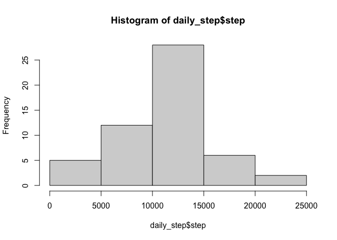
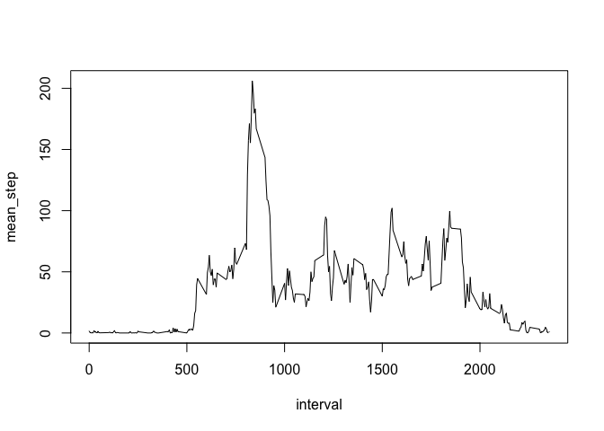
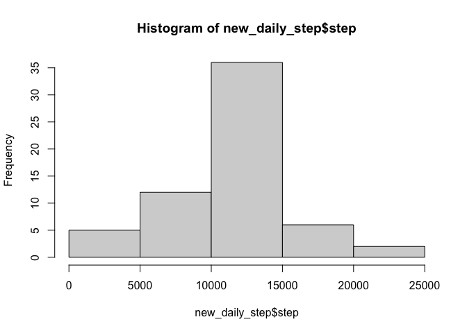
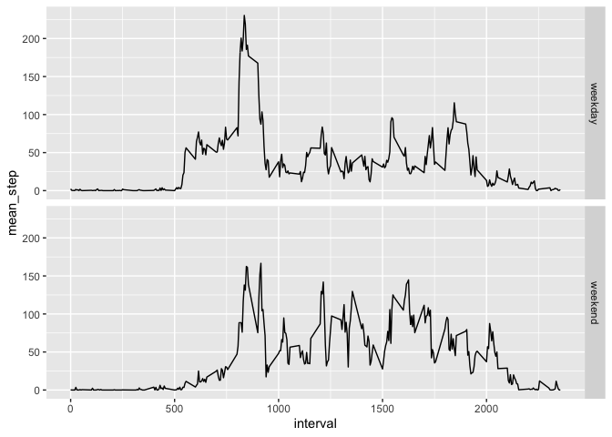

## Loading dataset and library

Let’s use the read.csv() function to load the dataset.

``` r
library(dplyr)
```

    ## 
    ## Attaching package: 'dplyr'

    ## The following objects are masked from 'package:stats':
    ## 
    ##     filter, lag

    ## The following objects are masked from 'package:base':
    ## 
    ##     intersect, setdiff, setequal, union

``` r
library(ggplot2)
df <- read.csv(file = 'rep_activity.csv', header=TRUE)
```

## Description of variables:

-   steps: Number of steps taking in a 5-minute interval (missing values
    are coded as NA)
-   date: The date on which the measurement was taken in YYYY-MM-DD
    format
-   interval: Identifier for the 5-minute interval in which measurement
    was taken

## What is mean total number of steps taken per day?

For now, we can ignore the missing values in the dataset. Let’s take a
look at the histogram of the total number of steps taken each day.

``` r
daily_step <- group_by(df[!is.na(df$steps),], date) %>% summarise(step = sum(steps))
hist(daily_step$step)
```



We then calculate and report the mean and median total number of steps
taken per day

``` r
step_summary <- group_by(df[!is.na(df$steps),], date) %>% summarise(mean_step = mean(steps), median_step = median(steps))
head(step_summary)
```

    ## # A tibble: 6 × 3
    ##   date       mean_step median_step
    ##   <chr>          <dbl>       <dbl>
    ## 1 2012-10-02     0.438           0
    ## 2 2012-10-03    39.4             0
    ## 3 2012-10-04    42.1             0
    ## 4 2012-10-05    46.2             0
    ## 5 2012-10-06    53.5             0
    ## 6 2012-10-07    38.2             0

## What is the average daily activity pattern?

Make a time series plot using base R plotting system (type = “l”) of the
5-minute interval (x-axis) and the average number of steps taken,
averaged across all days (y-axis)

``` r
step_5min <- group_by(df, interval) %>% summarise(mean_step =mean(steps, na.rm=TRUE))
plot(step_5min, type='l')
```



# 2. Which 5-minute interval, on average across all the days in the dataset, contains the maximum number of steps?

``` r
step_5min[which.max(step_5min$mean_step),1]
```

    ## # A tibble: 1 × 1
    ##   interval
    ##      <int>
    ## 1      835

## Imputing missing values

As we can see, there are a number of days/intervals where there are
missing values (coded as NA). The presence of missing days may introduce
bias into some calculations or summaries of the data.

1.  Calculate and report the total number of missing values in the
    dataset (i.e. the total number of rows with NAs)

``` r
nrow(df[is.na(df$steps),])
```

    ## [1] 2304

There are 2304 missing values.

1.  Devise a strategy for filling in all of the missing values in the
    dataset. The strategy does not need to be sophisticated. For
    example, you could use the mean/median for that day, or the mean for
    that 5-minute interval, etc. Here, we use the mean for that 5-minute
    interval.
2.  Create a new dataset that is equal to the original dataset but with
    the missing data filled in.

``` r
new_df <- df
for (i in 1:nrow(new_df)){
  if (is.na(new_df[i, "steps"])){
    impute <- 0
    interval <- df[i,'interval']
    for (j in 1:nrow(step_5min)){
      if (step_5min[j, 'interval'] == interval){
        impute <- step_5min[j, 'mean_step']
      }
    }
    new_df[i, "steps"] <- impute
  }
}
```

1.  Make a histogram of the total number of steps taken each day and
    Calculate and report the mean and median total number of steps taken
    per day. Do these values differ from the estimates from the first
    part of the assignment? What is the impact of imputing missing data
    on the estimates of the total daily number of steps?

``` r
new_daily_step <- group_by(new_df, date) %>% summarise(step = sum(steps))
hist(new_daily_step$step)
```



``` r
new_step_summary <- group_by(new_df, date) %>% summarise(mean_step = mean(steps), median_step = median(steps))
```

Let’s see the difference:

``` r
head(step_summary)
```

    ## # A tibble: 6 × 3
    ##   date       mean_step median_step
    ##   <chr>          <dbl>       <dbl>
    ## 1 2012-10-02     0.438           0
    ## 2 2012-10-03    39.4             0
    ## 3 2012-10-04    42.1             0
    ## 4 2012-10-05    46.2             0
    ## 5 2012-10-06    53.5             0
    ## 6 2012-10-07    38.2             0

``` r
head(new_step_summary)
```

    ## # A tibble: 6 × 3
    ##   date       mean_step median_step
    ##   <chr>          <dbl>       <dbl>
    ## 1 2012-10-01    37.4          34.1
    ## 2 2012-10-02     0.438         0  
    ## 3 2012-10-03    39.4           0  
    ## 4 2012-10-04    42.1           0  
    ## 5 2012-10-05    46.2           0  
    ## 6 2012-10-06    53.5           0

The median step increased while the mean step did not differ much. In
terms of total daily step, there are higher frequency of 10000-15000
steps after the imputation, as expected.

## Are there differences in activity patterns between weekdays and weekends?

For this part the weekdays() function may be of some help here. Use the
dataset with the filled-in missing values for this part. 1. Create a new
factor variable in the dataset with two levels – “weekday” and “weekend”
indicating whether a given date is a weekday or weekend day.

``` r
new_df$weekday <- weekdays(as.Date(df$date))
new_df$weekend_or_not <- ifelse(new_df$weekday =='Saturday' | new_df$weekday == 'Sunday', 'weekend', 'weekday')
new_df$weekend_or_not <- as.factor(new_df$weekend_or_not)
```

1.  Make a panel plot containing a time series plot (i.e. type = “l”) of
    the 5-minute interval (x-axis) and the average number of steps
    taken, averaged across all weekday days or weekend days (y-axis).
    The plot should look something like the following, which was created
    using simulated data:

``` r
new_step_5min <- group_by(new_df, interval, weekend_or_not) %>% summarise(mean_step =mean(steps))
```

    ## `summarise()` has grouped output by 'interval'. You can override using the `.groups` argument.

``` r
qplot(interval, mean_step, data=new_step_5min, facets = weekend_or_not~., geom='line')
```



During the weekdays, the maximum step is higher in the morning, compared
with the one on weekends. It may suggest that it is most people’s
working hours. However, the steps number distributed more evenly during
the weekends, possibly reflecting the leisure activity.
